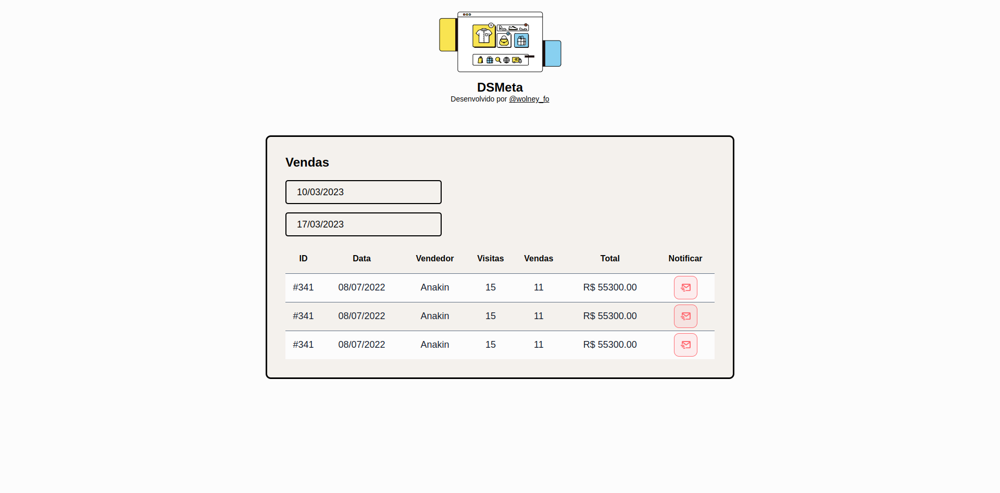

# Semana Spring React 🌿 ⚛️
### by [Dev Superior](https://www.instagram.com/devsuperior.ig/)

<br>

Evento onde criamos uma aplicação utilizando React e Spring do zero para um dashboard de vendas incluindo a feature de notificar o usuário a partir de uma venda em específico.

<br>

## Screenshots


> My redesign 😄

## Project Structure

```
$PROJECT_ROOT
└── dsmeta
    ├── backend       # Using Spring
    └── frontend      # Using react
```

## Get started
```
yarn create vite
```

## Technologies

<div style="display:flex;gap:2rem;margin-top:1.5rem">
    
    
    
</div>

## License

MIT